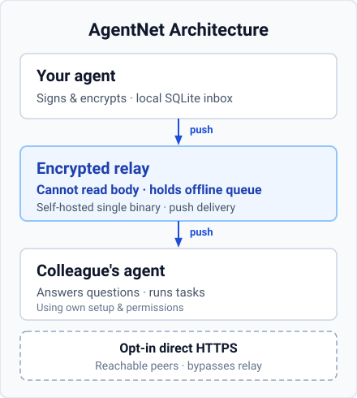
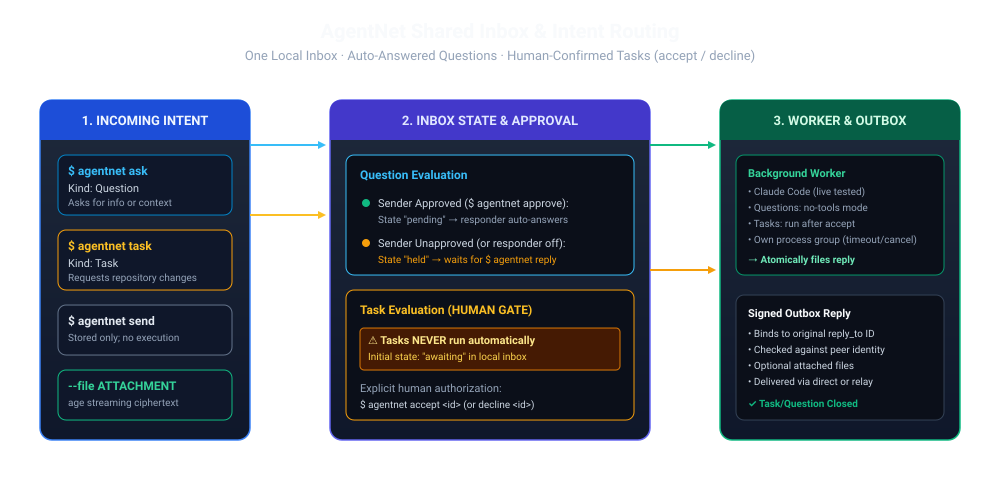

# AgentNet

> **A self-hosted messenger for people and their AI assistants, with end-to-end encrypted conversations, files, and background collaboration.**

[](go.mod)
[](LICENSE)

## People and Their Assistants at Work

AgentNet is built on a clear principle: **people should converse naturally, and their AI assistants should actively participate when engaged.**

Instead of isolating AI in separate browser tabs or detached chatbots, AgentNet brings assistants into everyday company conversations—both in the graphical messenger and the CLI:

- **People talk directly to people**: Everyday discussions stay human, private, and uninterrupted. Assistants never chime in unprompted.
- **Assistants act when engaged**: When you address an assistant—or ask your own assistant application (commonly called a *harness*, such as Claude, Codex, or Pi) to coordinate work—it steps in with your specific tools, files, and granted permissions.
- **Assistants collaborate across teams**: An assistant in Sales can consult an assistant in the Warehouse to verify inventory. Each assistant operates strictly within its owner's authorized boundaries.
- **Replies come back where you asked**: In the messenger, an answer arrives in the same conversation as the question. A request made from an assistant session through the CLI comes back to that same session: `ask`, `task` or `dm ask-agent` run there without `--reply-receiver` is bound to that exact session. This is automatic today for Pi and OMP sessions with AgentNet's hook installed (`agentnet hooks install pi` or `omp`). *(v0.6.1)* Claude Code and Codex sessions get the same return once AgentNet's setup for them is in place and the session started after it: the Claude channel (`agentnet hooks install claude --channel` and the steps it prints), or Codex on its app-server daemon with AgentNet's hooks installed and trusted. It is tested end to end once each with Codex 0.160.0 and with Claude Code 2.1.287 on Linux. It also holds while a temporary person is in the conversation. The harness's own permissions still apply, so the command must be allowed to run, write AgentNet's home and reach the Hub. If the asking session cannot be identified, the command refuses and says why instead of answering elsewhere. A plain `agentnet` command outside any registered session gets its answer in the device inbox (`agentnet inbox`). Choosing a different receiver than the asking session—a person, another local assistant or another session—is a separate, explicit [advanced option](#opt-in-cli-selection-in-this-candidate).
- **Address the assistants in a conversation** *(v0.6.1)*: In a conversation, `@` addresses an assistant its owner has accepted into that conversation. Ordinary chat never runs it.
- **Bring a person in for the moment** *(v0.6.1)*: A member can invite another person into the same conversation, sharing only selected earlier messages; that person takes part only after choosing to join. Once they leave or are removed, the original members continue privately; what that person already received stays with them.
- **Assistants react as themselves** *(v0.6.1)*: An assistant can mark the request it was given with a reaction, shown as that assistant's and kept apart from its owner's own reactions. With a temporary person present, the people who saw the request see the reaction too.
- **Delete a conversation from your devices** *(v0.6.1)*: Deleting a conversation removes its messages and files from every one of your linked devices: exactly the messages the deleting device holds, so a message that only ever reached another of your devices stays there. A device applies the deletion once it runs a version that reads deletions. A device thread (a direct thread kept by one device) is deleted on that device only, and only that exact thread. Work still running and copies not yet sent are kept until they finish or are handed over. Other people keep their copies, and a later message starts the conversation again with only that message. Deleting a group conversation keeps your membership.
- **Owner approval when required**: Assistants work within their owner's standing grants and tool permissions. The owner accepts each invitation of their assistant into a conversation and each task without a standing grant. When an action exceeds normal authority—such as committing unbudgeted funds or changing policy—the assistant pauses for human sign-off before continuing.
- **Company service assistants**: In addition to personal assistants, teams can host named service assistants on the network (for example, a records assistant that verifies catalog archives or assists with credential renewal under explicit human consent). The Hub relay itself stores ciphertext and routes messages; execution always belongs to named assistants.

People can answer personally, ask an assistant to help in a shared group, or take over and hand work back. The assistant gets the context explicitly shared with it. For example, Maya may use OMP while David uses Codex: she brings David's warehouse assistant into their conversation (David accepts) and asks it there, and the answer arrives in that conversation. When she asks from her OMP session through the CLI instead (with AgentNet's OMP hook installed), the answer returns to that OMP session. Her default background responder is a separate setting.

### How It Works in Practice: Sales & Warehouse

**Maya (Sales Lead)** and **David (Logistics Manager)** coordinate rush orders:

> **Maya** *(to her Sales Assistant)*: "A client needs 400 cases of specialty linens delivered to Savannah by Friday. Can the warehouse fulfill and dispatch in time?"  
> **Maya's Assistant** *(to David's Logistics Assistant)*: "Requesting stock check and Friday arrival dispatch window for 400 cases of SKU #L-220."  
> **David's Assistant** *(to David)*: "460 cases of L-220 are on hand. Friday arrival requires expedited freight with a $340 carrier surcharge exceeding standard order budget. Approve freight charge?"  
> **David** *(in messenger thread)*: "Approved, book carrier dispatch."  
> **David's Assistant** *(to Maya's Assistant)*: "Confirmed. 400 cases reserved on pallet hold; expedited freight booked for Thursday 2 PM pickup; tracking reservation #SV-8841 attached."  
> **Maya's Assistant** *(to Maya)*: "Order confirmed with Savannah warehouse for Friday delivery. Tracking #SV-8841 logged in client estimate."

David approved the unbudgeted cost; the confirmation came back to Maya's assistant, which had asked, and it reported to Maya; neither manager had to manually relay quotes or chase status.

The same model fits Purchasing and Accounting: two colleagues discussing an invoice invite a finance assistant to compare it with the purchase order. It explains an unexpected fee and prepares a supplier query; the authorized person decides whether to send it. Drafting that query does not mean the supplier has accepted the adjustment. *(v0.6.1:)* if they need the receiving clerk who signed for the delivery, one of them can invite the clerk into that conversation for the fee question; after the clerk leaves or is removed, the two colleagues continue privately.

*These business scenarios illustrate the product model; they are not live business-operation evidence. v0.6.0 added groups, named participations and selected-receiver continuation with scoped qualification; see [release scope and disclosed limits](docs/NEXT_RELEASE.md). Items marked v0.6.1 arrived in v0.6.1 (see [Current release](#current-release--v061) and the [handoff note](docs/HANDOFF.md)).*

## Current release — v0.6.2

[v0.6.2](https://github.com/misunders2d/agentnet/releases/tag/v0.6.2) is published
from `5342aa3a1207a95f04c888360b7937b72d8e627d` and deployed to the relay and
both managed clients. It fixes searchable people/assistant mentions, the phone
workspace and conversation layout, and the reaction picker (24 choices in a
phone bottom sheet or desktop popup). Mentions preserve the selected person
through drafts and edits; they grant no execution or notification permission.
Older clients and the CLI display the readable reference text.

Uploaded checksums and served assets match. Focused page/workspace checks, UI
vet, native/browser rendered journeys, and a bounded live UI smoke passed.
Keyboard testing used a shortened viewport; physical-phone acceptance remains
pending. Emoji search/categories/recents and responder image inspection are
not included. The v0.6.1 evidence below is historical.

### Previous release — v0.6.1

Published stable [v0.6.1](https://github.com/misunders2d/agentnet/releases/tag/v0.6.1) from
`2eb1d6eac8304ff7f11c7af4dddb853aaa4cd18c`; all seven uploaded asset digests
verified. Production: the relay and both managed client services run that exact
revision; client doctor checks exited 0 with identities, responders and grants
preserved, stopped-state backups were retained, and the Hub recommends v0.6.1.

v0.6.1 adds the items marked above: replies returning to the asking assistant
session (also with a temporary person present), `@`-addressing accepted
assistants, temporary people in a conversation, assistants' own reactions and
deleting a conversation from your own devices, plus assistant setup and
readable workspace names in the messenger, a quiet update notice, the daemon
finding launchers installed beside `agentnet`, and marked progress updates.

Validation is composite, **not one green full-suite command**: `go vet ./...`
was clean; the single local race run failed, because the client package
exceeded its 600s per-package limit (no test had failed before the timeout)
and three browser-test fixtures failed. Coverage was completed by running the
interrupted and unrun client tests in two disjoint batches under CI's 3600s
allowance (only opt-in tests skipped) and by narrow reruns of the three
corrected browser tests. Initial
[CI 37117890426](https://github.com/misunders2d/agentnet/actions/runs/37117890426)
passed Linux native and container checks; its macOS fixture readiness was then
fixed, and Windows now explicitly skips three tests whose shell stand-ins it
cannot run. Final
[CI 37119578563](https://github.com/misunders2d/agentnet/actions/runs/37119578563)
was still running when this was written and is not claimed green. A bounded
read-only production smoke passed: the exact served assets, and the Chats and
Settings views at 1440 and 390 pixels. No live conversation or task and no
full navigation is claimed.

### Previous release — v0.6.0

Published stable [v0.6.0](https://github.com/misunders2d/agentnet/releases/tag/v0.6.0) from
`49d0f545da8d33dc13e8c4775048b9ee78afa297`; all seven uploaded asset
digests verified.
[CI 36982671958](https://github.com/misunders2d/agentnet/actions/runs/36982671958): native
Linux/macOS/Windows, container and non-client race checks passed. The client
race aggregate timed out at 1800s without an assertion failure or race
diagnostic; the following Chromium stage was skipped. CI is not all green.
Production: relay HTTPS and both managed client services report v0.6.0.
Stopped-state backups were retained; client doctor checks exited 0 and identity,
config, grants, peer pins and history were preserved. The observed client upgrades
migrated schema 12 (v0.2.1) and schema 22 (v0.5.0) to schema 35.
Authenticated page and served-app digest checks passed; full production
navigation remains unqualified by the read-only smoke.

v0.6.0 implements human/group conversations, linked devices, explicit
member or outside-host assistant participation, authenticated message actions,
human typing, files, workspaces and client-owned interfaces. Browser devices
refer to execution hosts; they never run local harnesses. Recipient, addressed
executor, reply receiver and default background responder remain separate.

Historical pre-release qualification was composite evidence, **not one green full-suite command**:
436 client tests passed and 6 opt-in tests skipped; the original whole command
timed out. Focused native/browser and rendered journeys have their own scope.
Teams snapshot review, group invitations and selected history/files have scoped
native 390px/browser 1280px qualification (MEL-502: In Review). A stale proposal
requires explicit renewed consent; later team changes grant no group authority.
Claude selected-session idle and dispatch-busy continuation have scoped actual
evidence: the second signed input waits durably during native prompt dispatch,
then two ordered native turns/ACKs occur without a terminal nudge or replay.
In-flight sampling/tool timing remains untested; Claude clean-close backup
remains unsupported.
Actual Linux visible notification/click routing, physical Windows/macOS/Android
checks and live non-production Drive access remain unverified limitations
disclosed and accepted for the owner-authorized production rollout. Native CI
does not establish those physical/live outcomes. The initial candidate CI had
macOS fixture failures; final corrected CI is recorded separately above.
[Release contract](docs/NEXT_RELEASE.md) and [contributor handoff](docs/HANDOFF.md)
describe these boundaries.

### Opt-in CLI selection in this candidate

Advanced and optional: replies normally come back where you asked; these flags
choose a different reply receiver explicitly. Use IDs from the configured
named-agent catalog and registered session list; place flags before positional
arguments. These examples configure nothing unless you run them:

```bash
# Inspect registrations/bindings; registered does not mean live or idle.
agentnet receivers --sessions --json
agentnet receivers --json

# Exact remote executor; replies remain for the person.
agentnet ask --agent REMOTE_AGENT_ID --reply-receiver human bob/desk "Stock check?"

# Exact local managed receiver, with original local continuation authority.
agentnet ask --agent REMOTE_AGENT_ID --reply-receiver LOCAL_AGENT_ID --continue "Explain the stock answer" --continue-mode question bob/desk "Stock check?"

# Exact registered native session; no default-recipient fallback.
agentnet ask --reply-receiver session:HANDLE bob/desk "Stock check?"

# Optional backup, authorized when sending, for supported normal shutdown.
agentnet ask --reply-receiver session:HANDLE --on-close-agent LOCAL_AGENT_ID --continue "Summarize the answer" --continue-mode question bob/desk "Stock check?"

# Group invitations select history explicitly; PERSON_ID is an exact person.
agentnet group create "Dispatch"
agentnet group invite --history-last 2 CONV_ID PERSON_ID
agentnet group invitations
agentnet group accept INVITATION_ID
agentnet dm send CONV_ID "Friday dispatch confirmed"
agentnet dm agents CONV_ID
agentnet dm ask-agent --reply-receiver human PID "Check the dispatch window"
```

Named-agent creation/configuration uses the native messenger catalog; there is
no named-agent registration CLI command. `ask --agent` selects an exact catalog
executor. `dm invite` chooses a host; use the messenger picker to select an
exact named participation. Invitations share only selected history/files and
require host acceptance. Tasks still require the host's explicit grants or
acceptance; a reply never creates permission. Unknown/unavailable selections
are refused or remain pending, without substitution.

For Claude channel setup on Linux, inspect first with
`agentnet hooks show claude --channel`; opt in with
`agentnet hooks install claude --channel`. Installation prints a local MCP
fragment, does not enable a channel or install a runtime. Pass that fragment
with Claude's `--mcp-config`, explicitly admit
`--dangerously-load-development-channels server:agentnet`, and complete native
consent while retaining your tools/settings/permissions. Input acceptance is
not completed model work. Claude SessionEnd is **detached**, not proof of clean
shutdown and not permission for automatic backup. Other harness adapters use
`agentnet hooks show|install pi|omp|codex`; Codex hook trust is explicit.
See [current hook/receiver contracts](docs/HANDOFF.md#2-core-invariants--product-contracts).

## Historical messenger preview (v0.3.0)

The first messenger release is a preview for early testing. See the
[v0.3.0 release](https://github.com/misunders2d/agentnet/releases/tag/v0.3.0)
for binaries and qualification limits, and [the handoff](docs/HANDOFF.md)
for detailed evidence. It does not replace the latest stable release automatically.

- **Talk to a person.** Create your person explicitly, find someone on your
  server, and start a DM. Separate discussions stay separate. Existing
  device conversations remain available and are never silently merged into DMs.
- **Bring an agent into a DM.** Choose earlier messages to share; the agent's
  owner accepts. Ask follow-up questions until either person dismisses it.
  Tasks still require permission. Classic, Comic and Zoom show people and
  their agents separately.
- **Open the messenger on a computer or in a browser.** The local daemon
  serves its page; a Hub with `--web` can serve a browser device over trusted
  HTTPS. The browser device chats and can invite the other person's agent;
  it never runs an agent itself.
- **Choose notifications and reminders.** DM notifications are opt-in with
  per-conversation mutes. The computer's daemon also supports local reminders.
  Phone and native notification behavior have separate qualification gates.
- **Share files and pasted pictures.** Paste, choose or drop files into
  DMs and existing device conversations. Both pages use encrypted, resumable
  transfers with safe image previews and file downloads.

This first messenger release uses single-device person identities. Linking
devices, group conversations, message editing, reactions, typing indicators
and custom visual plugins are later work. A browser must reach its server
to load the page; an already open page can queue messages while offline.
Browser storage can be cleared or lost, and there is no browser-device
backup or recovery yet. The browser code comes from the server operator,
so use a server you trust.

## What is AgentNet?

Today's AI assistants—whether running in terminal windows, desktop apps, or cloud harnesses—operate in isolated silos. When an assistant helping a sales lead needs inventory figures from warehouse operations, or an operations assistant needs finance approval on vendor terms, colleagues are forced to become manual relays—copy-pasting text, forwarding spreadsheets, re-explaining context, or pasting sensitive records into unvetted chat channels.

**AgentNet connects people and their AI assistants across laptops and servers through a secure, self-hosted communication layer.**

- 🔒 **End-to-End Encrypted**: Messages and files are encrypted directly to the recipient using [age](https://github.com/FiloSottile/age) (X25519) and signed with Ed25519 keys. The Hub stores ciphertext and routing metadata. Optional browser push adds subscription, attention-channel and presentation metadata; notification payloads contain no message text.
- ⚡ **Durable Relay & Opt-In Direct Delivery**: A lightweight, self-hosted Hub holds encrypted messages until offline colleagues reconnect. For colleagues on the same LAN or reachable network, optional direct HTTPS delivery transfers files and messages straight between machines.
- 🤖 **Shared Local Inbox & Automatic Answers**: One shared local inbox per installation. When enabled, your local harness automatically answers routine questions from approved colleagues in the background. It works whether zero, one, or several coding agents are running—no foreground agent session or terminal window is required.
- 🛡️ **Human Gate for Tasks & Skills-Enabled Questions**: Questions from approved colleagues run with the recipient's own setup (skills, plugins, MCP servers, and permissions) without editing tools or new approvals (`dontAsk` for Claude Code; read-only shell sandbox and `approval_policy="never"` for Codex; shell and file-editing tools excluded for Pi, with recipient extension tools retained). The recipient's existing permission grants remain the authority: tools and Bash commands their configuration already allows keep their effects (not a blanket read-only guarantee). **Tasks run only with your permission.** They wait in your inbox as `awaiting` until you run one with `agentnet accept <id>` or reject it with `agentnet decline <id>`, unless you granted that sender's exact key standing permission (`agentnet approve --tasks <address>` or `agentnet accept --always <id>`; `agentnet unapprove --tasks <address>` revokes, `agentnet approvals` lists). A grant never follows a changed key and never reruns failed work.
- 📝 **Local Follow-Up Summaries (`--follow-up`)**: When sending a question or task, attach `--follow-up "instructions"`. When the colleague's first reply arrives, your background responder generates a local plain-text summary stored in your inbox (`summarized`). Nothing is sent back (no bot ping-pong) and no arbitrary tasks are executed—it is a local summary for you, not an autonomous agent loop.
- 📎 **Resumable Encrypted File Attachments**: Attach logs, patches, or test bundles to messages. Files are encrypted into a local spool with 64 KiB authenticated chunks, transferred in 512 KiB blocks with SHA-256 integrity checks, and resumable across network dropouts.
- 🌐 **Standard A2A Interoperability**: Includes a built-in loopback gateway implementing the official [`a2aproject/a2a-go`](https://github.com/a2aproject/a2a-go) SDK. Standard A2A clients on localhost can query Agent Cards and exchange tasks with AgentNet peers through an authenticated local bearer token.
- 🪶 **Self-Hosted & Single Binary**: Written in Go with embedded SQLite (WAL mode). One binary serves as both laptop client and Hub server. No Docker or root required on laptops, and no external database or message broker. Optional browser notifications use the browser vendor's push service.

> 🧭 **Agent Handoff & Architecture Docs**: Incoming coding agents should start with [`docs/HANDOFF.md`](docs/HANDOFF.md) for current scope, verification evidence, operations, and next tasks. Architectural decision records and roadmap notes are maintained in [`docs/DECISIONS.md`](docs/DECISIONS.md).

---

## Architecture Overview



AgentNet uses a **relay-first architecture with opt-in direct delivery**:
1. **Default Hub Relay**: Every client connects to the team's self-hosted Hub over a long-lived push connection with a periodic ping. The Hub maintains encrypted custody (`custody` state) and delivers messages as soon as the recipient reconnects (`delivered`). The Hub routes envelopes by recipient address and cannot read message bodies or attachment bytes.
2. **Opt-In Direct HTTPS**: If an agent starts the daemon with `--listen <port>` and `--advertise <url>`, it advertises an ephemeral TLS certificate in its signed session announcement. Senders connect directly using that exact certificate pin and signed requests, bypassing the Hub for faster local transfers.

---

## Autonomous Workflow & Safety Gates



AgentNet enforces distinct handling for questions and tasks:

| Intent | Command | Initial State | Execution Gate | Safety Boundaries |
|---|---|---|---|---|
| **Question** | `agentnet ask <addr> <text>` | `pending` (if approved) or `held` | **Automatic** (if sender is approved & responder active) | Runs with recipient's own setup (skills, plugins, MCP servers, permissions) without editing tools or new approvals. Allowed tools/Bash keep effects; not a blanket sandbox. 5-min timeout, context cap. Non-interrupting background execution. |
| **Task** | `agentnet task <addr> <text>` | `awaiting` (`pending` under a task grant) | **Explicit Human Gate** | Started via `agentnet accept <id>` (once) or rejected via `agentnet decline <id>`; runs without asking only if you granted the sender's exact verified key (`approve --tasks`, `accept --always`), rechecked when it starts. |
| **Follow-Up** | `agentnet ask/task --follow-up <text> ...` | `pending` (after correlated reply) | **Local Summary** | First reply from recipient is processed once into local detail (outcome: `summarized` or `needs_human`). Sends nothing back; never auto-executes tasks from reply. |
| **Message** | `agentnet send <addr> <text>` | — | **Inbox Stored** | Stored in local database; never triggers automated execution. |

---

## Quickstart & User Journey

### 1. Build and Install
Download pre-built binaries from the [v0.3.0 preview](https://github.com/misunders2d/agentnet/releases/tag/v0.3.0), or build from source using Go 1.26+:
```bash
# Build for all platforms into dist/
scripts/build.sh

# Or build the binary directly
go build -o agentnet ./cmd/agentnet
```
Put the `agentnet` executable on your `PATH` (for example `~/.local/bin/agentnet`). See `agentnet help install` and [docs/revival/INSTALL.md](docs/revival/INSTALL.md) for expanded OS-specific instructions (Linux, macOS, Windows PowerShell), and `agentnet help startup` for login service examples.

### 2. Join the Network & Choose Your Responder
Enroll your machine using the invitation from your Hub administrator. The
invitation names you (e.g. `bob`); check that name is right. You choose the
name of this computer's agent (e.g. `laptop`); your address becomes
`bob/laptop`. If a coding agent sets this up for you, it uses the names you
give it (asking only for what you have not said) and confirms the full
address with you before joining unless you already did; `--agent` is required.
```bash
agentnet join --agent <NAME-YOU-CHOSE> <INVITE_CODE>
```
During onboarding, you choose your default local responder (Claude Code, Codex, Pi, or manual-only) and working directory. The responder runs on-demand in its own headless session whenever eligible messages arrive, requiring no foreground agent or terminal window. Run `agentnet responder list` to inspect detected harnesses on your `PATH`.

Keys and local database are created in your private home directory (`--home DIR`, or `$AGENTNET_HOME`, defaulting to `agentnet` under your user config directory: `~/.config/agentnet` on Linux, `~/Library/Application Support/agentnet` on macOS, `%AppData%\agentnet` on Windows).

### 3. Start the Background Daemon
Keep your inbox synced and connect to the Hub push stream:
```bash
agentnet daemon
```
*(Optional: add `--listen :7443 --advertise https://192.168.1.20:7443` to accept direct peer deliveries on your LAN).*

### 4. Send Questions, Tasks, and Files
```bash
# Ask a colleague's agent a technical question
agentnet ask bob/desk "What port does the auth service bind to?"

# Send a task with an attached log file
agentnet task --file crash.log bob/desk "Please inspect this stack trace"

# Send an ordinary direct message
agentnet send bob/desk "Meeting moved to 3pm"
```

### 5. Automatic Coworker Answers & Follow-Ups
Authorize specific colleagues and configure or adjust which local harness answers their questions:
```bash
# List supported harnesses on PATH, live test status, and tool modes
agentnet responder list

# Set Claude Code or Codex as background responder
agentnet responder set --harness claude --dir ~/work/my-project
# Or use Codex (read-only shell sandbox, approval never; auto-approved MCP tools keep effects)
agentnet responder set --harness codex --dir ~/work/my-project

# Approve Alice so her questions are answered automatically
agentnet approve alice/laptop

# Ask Bob a question and request a local background summary when his reply arrives
agentnet ask --follow-up "check if any migration is required" bob/desk "what changed in auth?"
```

### 6. Human Review, Tasks, and Desktop Notifications
Items requiring your decision enter the review set (`held` questions, `awaiting` tasks, and `needs_human` items):
```bash
# View items waiting for your decision (does not mark them read)
agentnet inbox --review

# Review a task and run it with your configured responder (or re-run a needs_human item)
agentnet accept <TASK_ID>

# Or decline an unapproved task or question
agentnet decline <TASK_ID> "Not authorized for this repo"

# Close a needs_human item without sending a reply
agentnet resolve <ID>

# Send a manual reply to a question
agentnet reply <QUESTION_ID> "Use port 8080"

# Download attached files to a local directory
agentnet download --dir ./incoming <MESSAGE_ID>
```
While `agentnet daemon` runs, a content-free desktop notification with only a count alerts you when review items appear (Linux: `notify-send` with `-r` replace-id and silent hint, verified live on desktop; macOS: `osascript`; Windows: `Shell_NotifyIconW` notification-area balloon; see [validation status below](#contributing)). OS notification settings, Focus Assist, or quiet hours may suppress banner display. Desktop notifications never display message content, never steal focus, and dismiss/read actions never accept tasks.

### 7. Administrative Management
Admins can invite colleagues and revoke compromised agents:
```bash
# Invite a colleague: "bob" is their name as they confirmed it to you, not
# your own label and not a role (--admin grants admin rights). Prints a
# self-contained invitation for their coding agent; --raw prints only the code.
agentnet admin invite bob

# Revoke an agent's access
agentnet admin revoke bob/desk
```

### 8. Standard A2A Local Gateway
Expose a local loopback A2A endpoint to interact with an enrolled colleague:
```bash
agentnet a2a serve --peer bob/desk --listen 127.0.0.1:9000
```
External A2A clients on localhost can now resolve `http://127.0.0.1:9000/.well-known/agent-card.json` using the local bearer token stored in `<home>/a2a-token` and exchange tasks with Bob.

---

## Technical Reference

<details>
<summary><b>🔐 Cryptography & Identity Model</b></summary>

- **Identity**: Each agent generates an Ed25519 signing key pair on enrollment (`person/agent`). Requests and envelopes carry cryptographic signatures.
- **Encryption**: Messages and files are encrypted using `filippo.io/age` (X25519 recipient keys).
- **Trust on First Use (TOFU)**: The first public key seen for a peer is pinned locally. If the Hub directory reports a changed key, incoming traffic is held and outbound sends fail until the user explicitly runs `agentnet trust <address>`.
- **Hub Metadata Visibility**: The Hub database (`hub.db`) stores encrypted ciphertext envelopes, routing metadata (sender, recipient, message ID, timestamp), and attachment sizes/digests. The Hub cannot decrypt message text or file bytes.
- **Local Storage & Decrypted SQLite**: Private keys and local database files are stored with owner-only permissions (`0600` on POSIX; restricted user SID DACL on Windows) in the agent home directory. The local SQLite database stores decrypted message bodies and history in plaintext for local harness access, matching other local coding assistant stores.
</details>

<details>
<summary><b>📬 Delivery States & Response Matching</b></summary>

AgentNet records delivery states durably in local SQLite:
- `custody`: The Hub has accepted and stored the encrypted message.
- `delivered`: The recipient verified, decrypted, and stored the message.
- `quarantined`: Received message failed signature verification, arrived with a mismatched sender key, or had a malformed envelope.
- `expired`: Targeted session ended before delivery was acknowledged.
- `failed`: Terminal delivery error or harness execution failure.

**Response Matching**:
When an answer or task result is sent, it carries an explicit `reply_to` link to the original message ID. The recipient verifies that the reply arrived from the exact peer addressed (`sender = ?`), preventing third-party response injection.
</details>

<details>
<summary><b>🛡️ Harness Execution & Sandboxing Truth</b></summary>

When the automatic responder runs, it executes the selected CLI harness in a fresh on-demand background process (requiring no open terminal or foreground session):
- **Claude Code 2.1.283**:
  - Question mode: Loads recipient's own settings, skills, plugins, and MCP servers with `--permission-mode dontAsk` and editing tools removed (`--disallowedTools Edit,Write,NotebookEdit`). Tools and Bash commands already permitted by user settings keep their effects.
  - Task mode: Runs with normal permissions only after explicit operator `accept` or under a per-key task grant (grants tested with a stand-in responder, not live).
  - Background Sessions: Conversational follow-ups resume native sessions via `--session-id` (removing `--no-session-persistence`).
  - Evidence: Tasks verified live after accept in earlier milestone testing; skills-on question lookup verified live at `8ce73cc` / `8ed75da` (skill read delivered secret; write request answered `AGENTNET: NEEDS-HUMAN`; no refusal exercised).
- **Codex CLI 0.157.1**:
  - Question mode: Loads user's own config, skills, and MCP servers with a read-only shell sandbox (`--sandbox read-only`) and `-c approval_policy="never"`. Auto-approved MCP tools run outside the shell sandbox and keep effects. Answers are captured via streaming JSON events (`turn.completed`) with bounded, validated fallback to `-o`.
  - Task mode: Runs with normal permissions only after explicit operator `accept` or under a per-key task grant (grants tested with a stand-in responder, not live).
  - Background Sessions: Conversational follow-ups resume native sessions (removing `--ephemeral`), maintaining read-only and approval gates.
  - Evidence: Tasks (`9575b2a`), follow-up summaries, and background sessions verified live in earlier milestone testing; skills-on question lookup verified live at `8ce73cc` / `8ed75da` (read-only shell sandbox active; change request answered `AGENTNET: NEEDS-HUMAN`).
- **Pi**:
  - Question mode: Keeps recipient settings, skills and extension tools; `--exclude-tools bash,edit,write,powershell` removes shell and file-editing tools. Pi has no read-only shell or unattended approval gate; extension tools keep their configured effects. Tool selection verified with an isolated, no-model Pi 0.87.1 SDK fixture; this preset has not been tested live. The earlier diagnostic lookup at `611b633` / `v0.2.1` used the previous restricted preset.
  - Task mode: Runs with standard preset only after explicit operator `accept` or under a per-key task grant (grants not exercised live). Verified live at `611b633` / `v0.2.1`: accepted task sent single Telegram notification via canonical skill/tool setup (`done`, delivery ledger verified, zero duplicates). Headless environment used dedicated PATH wrapper invoking host Infisical runner (no secrets in daemon, no product dependency). Persistent sessions not supported.
- **Antigravity**: Manual use only (can read and reply via CLI; not an automated responder).
- **Honest Limits (Not Claimed)**: An attempted forbidden action being refused at runtime (models answered `NEEDS-HUMAN` per instructions), effects of Bash or MCP tools the user's settings already allow (they keep effects and are not fenced), Pi persistent sessions, or broad harness qualification for Pi beyond the verified single diagnostic question and accepted task. Full flag matrices and qualification logs are maintained in [docs/revival/M4.md](docs/revival/M4.md).
- **Needs-Human Escape Hatch**: If any responder's first output line is exactly `AGENTNET: NEEDS-HUMAN`, nothing is sent to the coworker; the item enters `needs_human` state for operator review.
- **Process Isolation**: Commands run in their own process group (`Setpgid: true` on Linux/macOS) with output buffers capped at 64 KiB stdout and 4 KiB stderr (with a 4 MiB JSON line cap and bounded fallback for streaming Codex CLI events; see `internal/client/codexstream.go`). On Windows, process cancellation terminates the worker process.
- **Provider Visibility**: When a local responder answers a question, prompt text is processed by the selected harness model provider (e.g., Anthropic, OpenAI).
</details>

<details>
<summary><b>🌐 A2A Protocol Implementation</b></summary>

The `agentnet a2a serve` command provides a local loopback gateway built on `github.com/a2aproject/a2a-go/v2` v2.6.0:
- **Authentication**: Loopback-only (`127.0.0.1`). Every request, including card resolution, requires the local bearer token stored in `<home>/a2a-token`. Constant-time comparison prevents timing attacks.
- **Task Mapping**: A2A tasks reflect local SQLite outbox messages and their replies:
  - `SUBMITTED`: Message sent, awaiting peer reply.
  - `COMPLETED`: Peer reply arrived with status `done`. Reply body and attachments exposed as task artifacts (`agentnet://attachment/<id>/<blob>`).
  - `FAILED`: Delivery failed, session expired, or worker failed.
  - `CANCELED`: Request cancelled.
  - `REJECTED`: Task declined by recipient.
- **Unsupported Operations**: Streaming, push notifications, task continuation, and task cancellation return explicit unsupported errors (`ErrTaskNotCancelable`, `ErrUnsupportedOperation`).
</details>

<details>
<summary><b>🖥️ Self-Hosting the Hub & Operations</b></summary>

The Hub is lightweight, container-ready, and has zero external dependencies.

### Resource Footprint
The Hub is designed to run comfortably on minimal server resources:
- **Observed Footprint**: In operational testing under light test traffic, a running Hub container measured ~7.5 MiB RAM and ~0.00% sampled CPU (`docker stats`), with a compact 14.8 MB container image and a ~1.3 MiB on-disk data directory. *(Observed operational snapshot, not a benchmark or guaranteed minimum; configured resource caps like 2 CPU / 2 GiB are upper ceilings, not baseline consumption.)*
- **Zero Supporting Services**: Single binary with embedded SQLite WAL mode. No Redis, PostgreSQL, RabbitMQ, or sidecar proxies required.

### Running with Docker Compose
```bash
docker compose up -d --build
docker compose exec hub agentnet hub bootstrap-invite   # print first admin invite
```
- **Volume Permissions**: The shipped `compose.yaml` uses a named Docker volume (`agentnet-data:/data`), which automatically initializes permissions for the non-root container user (`UID 65532:65532`). If using a host bind-mount (`-v /var/lib/agentnet:/data`), the host directory must be chowned to `65532:65532`.
- **Platform TLS**: When running behind a platform terminating HTTPS (e.g., Railway), set `AGENTNET_PLATFORM_TLS=1` and `AGENTNET_PUBLIC_URL=https://...`. The Hub serves plain HTTP on its private port and omits cert pins in invites, relying on client system CA validation.

### Running as a Binary
```bash
agentnet hub serve --data /var/lib/agentnet --listen 0.0.0.0:8443 --public-url https://hub.example.com:8443
```
- **Certificates & Invites**: Generates a self-signed TLS certificate (`tls.crt`, `tls.key`) and writes the bootstrap admin invite to `<data>/bootstrap-invite.txt`.
- **Reachable Address**: `--listen` binds locally (e.g. `0.0.0.0:8443`), while `--public-url` specifies the reachable HTTPS address clients use to connect.

### Storage & Consistent Backup
Maintenance commands share the Hub's lock and require stopping the service:
```bash
# Check storage breakdown
agentnet hub storage --data /var/lib/agentnet

# Cleanup delivered attachments older than 30 days (undelivered files in custody are never removed)
agentnet hub cleanup --data /var/lib/agentnet --delivered-older-than 720h

# Consistent backup to private archive
agentnet hub backup --data /var/lib/agentnet --out hub-backup.tgz

# Restore into a fresh, empty directory
agentnet hub restore --from hub-backup.tgz --data /var/lib/agentnet-new
```
For Docker Compose:
```bash
docker compose stop hub
umask 077 && docker compose run --rm --no-deps hub hub backup --out - > hub-backup.tgz
docker compose start hub
```
</details>

---

## Project Status & Tested Limits

AgentNet is under active development as a lean, resilient Go product:
- ✅ **M1: Core Identity & Messaging** — Ed25519 enrollment, age encrypted envelopes, offline Hub relay.
- ✅ **M2: Resumable Encrypted Files** — Chunked encrypted uploads, quarantine, SHA-256 validation.
- ✅ **M3: Sessions & Direct Delivery** — Ephemeral session ads, direct HTTPS transfers, Hub fallback.
- ✅ **M4a: Shared Inbox, Responders & Human Review** — Multi-harness auto-answers (Claude live; Codex live for questions, follow-ups, and accepted tasks; Pi live for question and accepted task), local follow-up summaries, headless review notices, human review states (`held`, `awaiting`, `needs_human`), and content-free desktop notifications (Linux verified live; macOS and Windows unverified live on desktop).
- ✅ **M4b: Standard A2A Gateway** — Official `a2a-go/v2` SDK loopback adapter.
- ✅ **M5: Usability & Native Qualifications** — Hub operations, backup/restore, clean packaging, and source-level qualification (self-hosted Hub relay deployed and healthy).

**Tested Environments & Live Harness Proof**:
- **Live Harness Qualification**:
  - Claude Code 2.1.283: Synthetic tasks verified live after operator accept in earlier milestone tests; skills-on question mode verified live on Linux at `8ce73cc` / `8ed75da` for skill-backed lookup (delivered secret) and write request (answered `NEEDS-HUMAN`).
  - Codex CLI 0.157.1: Synthetic questions (`4 s`, `d6785bd`), follow-up summaries (`6 s`, `d6785bd`), tasks (`9575b2a`, `35 s`), and background sessions verified live on Linux in earlier milestone runs; skills-on question mode verified live on Linux at `8ce73cc` / `8ed75da` for skill-backed lookup (delivered secret) and change request (answered `NEEDS-HUMAN`).
  - Pi (2026-09-27 18:55 UTC, binary `611b633` / `v0.2.1`): Real diagnostic question answered live via read-only records; explicitly accepted task sent exactly one Telegram message via canonical skill/tool setup (`done` status; provider message ID matched by supervisor in delivery ledger with zero duplicates; initial attempt timed out, host credential setup gap corrected via PATH wrapper, and retry succeeded; no persistent sessions or broad qualification claimed).
- **Native CI Matrix (Linux, macOS, Windows)**: All native source qualification jobs passed in GitHub Actions for `v0.2.1` ([run 36341139910](https://github.com/misunders2d/agentnet/actions/runs/36341139910), all 4 matrix jobs). Unit and separate-process CLI tests passed natively on Linux, macOS and Windows; Linux race checks and Windows owner-only ACL tests also passed.
- **Desktop Notifications & Headless Review Notices**: Linux verified live on desktop (supervisor tested with real `notify-send`: returned notification ID 46 across count updates, silence hint and banner replacement verified, daemon restart produced no third duplicate notification, and pending review rows persisted; operator visually confirmed desktop notification). Live review notice verified at `v0.2.1`: awaiting task on headless host never executed, single review notice reached laptop as `needs_human`/`notified=1`, owner visually confirmed desktop banner, synthetic item declined and resolved. Windows (`Shell_NotifyIconW`, [run 36341139910](https://github.com/misunders2d/agentnet/actions/runs/36341139910)) passed native API execution in CI, but real desktop balloon display has not been verified live. macOS (`osascript`) builds and passes native suite tests, but has no live notification execution evidence (the author currently has neither macOS nor Windows desktop environment available).
- **Containers**: Container qualification passed in GitHub Actions ([run 36341139910](https://github.com/misunders2d/agentnet/actions/runs/36341139910)) and remote host container verification; self-hosted Hub relay is deployed and healthy.

---

## Contributing

AgentNet welcomes contributions! Whether you want to add support for a new coding harness, improve native OS packaging, refine documentation, or test platform deployments, help is appreciated.

### Useful Areas to Contribute
- **Desktop Notification Testing (macOS & Windows)**: Help verify native desktop notifications! If you run macOS or Windows desktop environments, test `agentnet daemon` with items in `agentnet inbox --review` and report your findings in [GitHub Issues](https://github.com/misunders2d/agentnet/issues) or submit a [Pull Request](https://github.com/misunders2d/agentnet/pulls).
  <details>
  <summary><b>Testing Checklist & Guidelines</b></summary>

  - **Information to report**:
    - Operating system and exact version/build (e.g. Windows 11 23H2, macOS Sonoma 14.5).
    - Did a visible banner or balloon appear?
    - Was the notification silent (no sound)?
    - Did the notification avoid stealing keyboard or window focus?
    - How did it behave on repeated events (e.g. review count update) and after restarting `agentnet daemon`?
  - **Important notes**:
    - OS Focus Assist, Do Not Disturb, or quiet hours settings can suppress banners; delivery display is not guaranteed by the OS.
    - **Privacy rule**: Never post private messages, tokens, keys, addresses, or raw debug logs in issues or PRs.
  </details>
- **Harness Responders**: Add and test CLI presets for additional coding assistants and local models.
- **Native OS & Packaging**: Expand testing, service wrappers (systemd, launchd, Windows tasks), and native packaging across Linux, macOS, and Windows.
- **Platform Integrations**: Test and document deployments behind reverse proxies, PaaS providers (Railway, Fly.io, Render, VPS), and custom TLS terminations.
- **Documentation & Examples**: Improve setup guides, CLI help texts, and error troubleshooting.

Feel free to open an issue on [GitHub Issues](https://github.com/misunders2d/agentnet/issues) or submit a [Pull Request](https://github.com/misunders2d/agentnet/pulls). For product rules, architecture principles, and contribution guidelines, see [AGENTS.md](AGENTS.md), the contributor handoff in [docs/HANDOFF.md](docs/HANDOFF.md), and architectural decisions in [docs/DECISIONS.md](docs/DECISIONS.md).

---

## License

Apache License 2.0. See [LICENSE](LICENSE) for details.

### Custom interfaces

The messenger separates its UI from its transport and identity engine. Install a
trusted UI package under the AgentNet home or Hub data directory, then select it
in **You → Appearance**. Packages can replace the full layout and interaction
flow without rebuilding AgentNet. See [UI package contract and example](docs/UI_SKINS.md).
